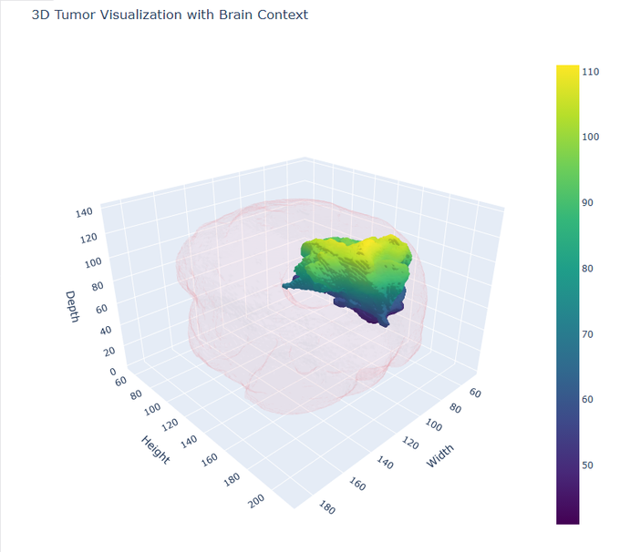

# Brain-Tumor-Segmentation

This project presents a deep learning-based pipeline for brain tumor segmentation using MRI scans. Leveraging a U-Net architecture, the model is trained to accurately detect tumor regions within brain images. The performance of the model is evaluated using Dice coefficient and loss metrics, ensuring reliable segmentation results.

Interactive demo live 👉 https://t.co/8WimhfZKKn

<p align="left"> 

# Repository structure

* Brain_tumor_segmentation_final.ipynb : Main notebook containing the entire project workflow (data loading, training, evaluation, etc.)
* requirements.txt : Dependencies required to run the project
* presentation/ : Contains a presentation version of the project, viewable as slides in JupyterLab
  * presentation_file.ipynb - Presentation notebook
  * presentation_file.html - HTML slideshow version
* demo_file/ : Files used for 3D tumor visualization on Hugging Face Spaces 
  * app.py - Main 3D visualization script using Plotly
  * requirements.txt - Dependencies required to run the demo
* saved_file/ : Contains files saved during training 
  * my_model (1).keras - Saved trained model
  * training (1) - File storing training and validation metrics per epoch
 
## Features

- U-Net architecture for 2D tumor slice segmentation
- Custom loss function: Dice Loss + Categorical Crossentropy
- Real-time 3D visualization of tumor regions using Plotly
- Presentation-ready slide deck for project walkthrough
- Compatible with Hugging Face Spaces demo deployment

## Requirements

Install all dependencies using:

```bash
pip install -r requirements.txt
